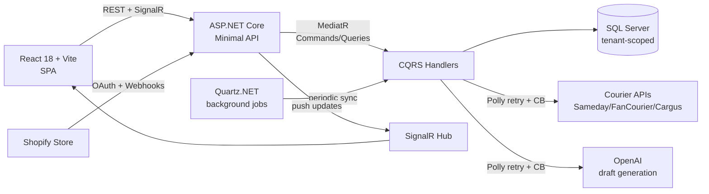

# InboxAI

> Multi-tenant SaaS for automating Romanian e-commerce customer support — built to deepen practice in CQRS, resilience patterns, and integration testing.

**Status:** 🚧 Active development · v0.1 · solo project

---

## Why this exists

InboxAI is a portfolio project I started to push myself beyond what my current job covers. At work I maintain a production platform with significant business complexity, but the codebase predates modern testing and CI/CD practice — coverage is near zero, deploys are manual, and resilience is mostly defensive try/catches.

I wanted a sandbox where I could practice the patterns I read about but rarely get to apply end-to-end:

- **CQRS with MediatR** — small, focused handlers instead of fat services.
- **Resilience with Polly** — retry and circuit-breaker policies on outbound HTTP, not bolted-on after the fact.
- **Real test coverage** — xUnit + Moq + FluentAssertions, with handler-level tests covering happy paths, edge cases, and cross-mock call ordering.
- **Multi-tenancy done properly** — tenant resolution, isolation, and data scoping as first-class concerns rather than a single global query filter.
- **Real-time updates** — SignalR for ticket and order-status changes pushed to the client.

The domain — automated support replies for Romanian Shopify stores — is incidental; it gives me realistic constraints (OAuth, courier APIs, AI-generated drafts) without being so complex that it distracts from the engineering practice.

---

## Architecture



**Request flow:** A ticket arrives (manual or via Shopify webhook) → MediatR handler validates the tenant, resolves the order number, calls courier APIs for AWB status (Polly-wrapped), asks OpenAI for a draft reply intent, persists the result, and pushes a SignalR notification to the connected client.

---

## Tech stack

| Layer | Choices | Why |
|---|---|---|
| **API** | ASP.NET Core 8 Minimal API | Lower ceremony than controllers; endpoints stay close to handlers. |
| **Application** | MediatR (CQRS) | Each command/query is a small, isolated unit — easy to test, easy to reason about. |
| **Persistence** | EF Core 8 + SQLite | Lightweight; zero infrastructure for local dev. Migration to SQL Server planned before deploy. |
| **Resilience** | Polly | Retry + circuit-breaker on courier and OpenAI calls — Sameday, FanCourier, and Cargus APIs are inconsistent (timeouts, sporadic 5xx). |
| **Background jobs** | Quartz.NET | Periodic order-status sync, decoupled from request lifecycle. |
| **Real-time** | SignalR | Ticket and AWB updates pushed to the SPA without polling. |
| **Auth (tenant)** | Shopify OAuth 2.0 | Standard flow for multi-tenant SaaS onboarding. |
| **Testing** | xUnit · Moq · FluentAssertions | Handler tests with cross-mock call-order verification via `Callback` sequences. |
| **Frontend** | React 18 · Vite · JavaScript · Tailwind | Fast iteration. |

---

## Running locally

> A docker-compose setup is on the roadmap. For now, run the two services separately.

**Prerequisites:** .NET 8 SDK · Node.js 20+

**Backend:**
```bash
cd Wismo.Api
dotnet run
```

**Frontend:**
```bash
cd wismo-ui
npm install
npm run dev
```

The API runs on `https://localhost:5001` and the SPA on `http://localhost:5173`.

Configuration (Shopify keys, OpenAI key, connection string) goes in `appsettings.Development.json` — see `appsettings.Example.json` for the shape.

---

## Design decisions

A few choices worth calling out, because they're the kind of thing I'd want to discuss in a code review:

**Why MediatR over plain services.** Services tend to grow into 1000-line classes with mixed concerns — that's exactly what I'm trying to escape from at work. MediatR forces one handler per use-case, which keeps the surface small and tests focused. The cost is some indirection; for a project this size, the trade is worth it.

**Why Polly wrapping every outbound HTTP call.** Courier APIs in Romania are inconsistent — timeouts, sporadic 5xx, occasional rate limits. Building retry/circuit-breaker into a typed `HttpClient` from day one is much cheaper than retrofitting it after the first production incident.

**Tenant isolation strategy.** Currently uses an EF Core global query filter on `SupportTicket` as the first layer of isolation — convenient and covers the common case. The known gap: global filters can be bypassed (`.IgnoreQueryFilters()`, raw SQL), so on the roadmap is lifting tenant resolution to explicit handler-level predicates for defense-in-depth. Calling this out because it's exactly the kind of trade-off that's easy to leave unexamined.

**Why xUnit + Moq for handler tests instead of integration tests first.** Integration tests are on the roadmap, but handler-level tests are the highest-ROI starting point: they cover business logic without the cost of spinning up a test database. Integration tests come next, layered on top, not as a substitute.

---

## Roadmap

- [x] Multi-tenant ticket ingestion + Shopify OAuth onboarding
- [x] AI-assisted draft generation (OpenAI)
- [x] Courier AWB resolution with Polly resilience
- [x] SignalR real-time updates
- [x] xUnit handler test suite (current focus: pushing to ~75% coverage)
- [ ] GitHub Actions CI (build + test on push)
- [ ] Integration tests with Testcontainers
- [ ] docker-compose for one-command local setup
- [ ] Deploy to Azure (App Service + Azure SQL)

---

## About

Built by [Alex Avram](https://github.com/AvramAlexC) — .NET developer in Timișoara.  
Reach me at avramalexc.8@gmail.com or on [LinkedIn](https://www.linkedin.com/in/alexandru-avram-75951b1a9/).
