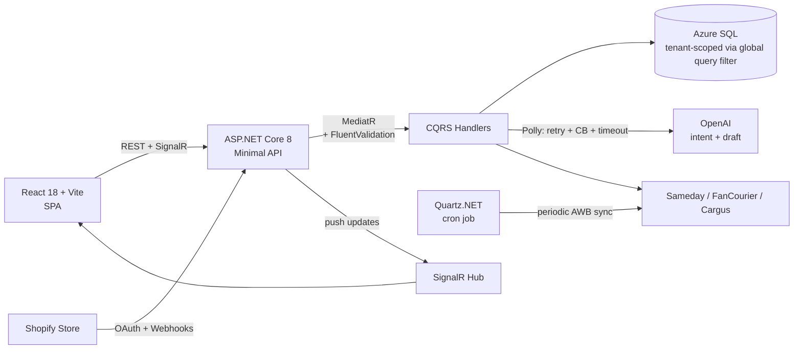

# InboxAI

> Multi-tenant SaaS for Romanian e-commerce support automation.

**Status:** active development · v0.1 · solo project

---

## What it is

A backend + SPA that ingests customer support tickets for Romanian Shopify stores, classifies them with OpenAI (WISMO / refund / question / spam), extracts the order number and email, drafts a reply in Romanian, and tracks AWB status against Sameday, FanCourier, and Cargus. Tenants share a single database with row-level scoping by JWT-resolved `tenant_id`.

The domain is incidental — it's a portfolio project built to practice CQRS, resilience patterns, multi-tenant scoping, and handler-level testing end-to-end.

---

## How it works


```mermaid
flowchart LR
    Client[React 18 + Vite<br/>SPA] -->|REST + SignalR| API[ASP.NET Core 8<br/>Minimal API]
    Shopify[Shopify Store] -->|OAuth + Webhooks| API
    API -->|MediatR<br/>+ FluentValidation| Handlers[CQRS Handlers]
    Handlers --> DB[(Azure SQL<br/>tenant-scoped via global query filter)]
    Handlers -->|Polly: retry + CB + timeout| OpenAI[OpenAI<br/>intent + draft]
    Quartz[Quartz.NET<br/>cron job] -->|periodic AWB sync| Couriers[Sameday / FanCourier / Cargus]
    Handlers --> Couriers
    API -->|push updates| Hub[SignalR Hub] --> Client
```

**Request flow.** A ticket arrives (manual API call or Shopify webhook) → JWT middleware resolves the tenant from the `tenant_id` claim → MediatR handler runs through a `ValidationBehavior` pipeline → `OpenAIProcessorService` classifies the message and extracts order/email (with a regex fallback if the AI call fails) → the result is persisted under the tenant's scope → `TenantNotificationService` pushes a SignalR update to that tenant's connected clients. Separately, a Quartz cron job (`AwbStatusUpdateJob`, default every 10 minutes) walks in-transit tickets and refreshes their AWB status from the right courier client.

---

## Tech stack

**Backend** (`Wismo.Api/`)
- ASP.NET Core 8 Minimal API
- MediatR 14 (CQRS) + FluentValidation pipeline behavior
- EF Core 8 + SQL Server — Azure SQL in production, migrations applied at startup; `EnableRetryOnFailure` (8 attempts, 30s cap) to survive serverless cold starts
- Polly via `Microsoft.Extensions.Http.Polly` — retry, circuit breaker, and per-attempt timeout on the OpenAI client
- Quartz.NET hosted service for cron jobs
- SignalR for real-time tenant dashboard updates
- JWT bearer auth (`System.IdentityModel.Tokens.Jwt`)
- Swashbuckle for Swagger in Development

**Frontend** (`wismo-ui/`)
- React 18 + Vite 4 (JavaScript, not TypeScript)
- Tailwind CSS v4
- Axios + `@microsoft/signalr`
- Vitest + Testing Library

**Tests** (`Wismo.Api.Tests/`)
- xUnit + Moq + FluentAssertions
- Handler-level tests with cross-mock call-order verification

**CI**
- GitHub Actions: build + test on push for both backend and frontend; the backend build fails on compiler warnings.

---

## Running locally

**Prerequisites:** .NET 8 SDK · Node.js 20+

**Backend**
```bash
cd Wismo.Api
cp appsettings.Example.json appsettings.json   # then fill in OpenAI:ApiKey, Jwt:SigningKey
dotnet run
```
Set `ConnectionStrings:Default` to a local SQL Server or LocalDB instance, then run `dotnet ef database update` before the first `dotnet run`. There is no SQLite fallback — the connection string is validated fail-fast at startup.

Default URL: `http://localhost:5255` (Swagger at `/swagger`, health at `/health`).

**Frontend**
```bash
cd wismo-ui
cp .env.example .env
npm install
npm run dev          # http://localhost:5173
```
The SPA reads `VITE_API_BASE_URL` and falls back to `http://localhost:5255`.

**Tests**
```bash
dotnet test Wismo.Api.Tests
cd wismo-ui && npm test
```

Shopify OAuth and webhook secrets live under the `Shopify:OAuth` and `Shopify:Webhook` sections of `appsettings.json` (or .NET User Secrets — there's a `UserSecretsId` set on the csproj).

---

## Architecture decisions

A few choices worth calling out, because they're the kind of thing I'd want to discuss in a code review:

**Why MediatR over plain services.** Services tend to grow into 1000-line classes with mixed concerns — that's exactly what I'm trying to escape from at my day job. MediatR forces one handler per use-case, which keeps the surface small and tests focused. The cost is some indirection; for a project this size, the trade is worth it.

**Why Polly wrapping every outbound HTTP call instead of try/catch.** Courier APIs in Romania are inconsistent — timeouts, sporadic 5xx, occasional rate limits. Try/catch handles failure but doesn't *react* to it — it can't back off exponentially with jitter, can't open a circuit when the upstream is clearly down, can't enforce a per-attempt timeout independent of the overall HTTP client timeout. Building those in via Polly from day one is also much cheaper than retrofitting them after the first production incident.

**Tenant isolation strategy.** EF Core global query filters are applied to every tenant-owned entity — `SupportTicket`, `StoreUser`, `ShopifyStoreConnection` — giving default-deny scoping at the `DbContext` level. The few legitimate cross-tenant reads opt out explicitly via `.IgnoreQueryFilters()` at the call site, which makes intentional boundary crossings visible in code review.

I considered the alternative — handler-level predicates (`Where(x => x.TenantId == ctx.TenantId)` in each query) — and rejected it for two reasons. First, a forgotten predicate in a new handler is a silent tenant leak, while a missing global filter on an entity is detectable at `DbContext` setup. Second, the predicate gets repeated in every query for no real safety gain, since both approaches still rely on the developer.

Trade-off I'll own: tenant scope isn't visible in any individual handler without knowing the `DbContext`-level convention. Acceptable, because the alternative pushes complexity into every handler without actually reducing risk.

**Why SQLite for dev.** It needs zero infrastructure — clone, `dotnet run`, you have a working DB. The `DbContext` is provider-agnostic (no SQLite-specific column types or functions), so moving to a server-based DB later is a connection-string change plus migrations. Two tables (`StoreUsers`, `ShopifyStoreConnections`) are currently created via raw `CREATE TABLE IF NOT EXISTS` in `Program.cs` rather than EF migrations — fine for now, replaced when migrations land.

**Why Quartz over Hangfire.** The only background work right now is a single cron job (AWB status refresh). Quartz is in-process, has no dashboard/storage requirements, and the cron expression lives in `appsettings.json`. Hangfire's storage + dashboard story buys nothing at this scale.

---

## Deployment

Live on Azure App Service (Linux, Sweden Central) at `https://inboxai-c8csf5awegetfphw.swedencentral-01.azurewebsites.net`.

**Data.** Azure SQL, serverless tier with a 60-minute auto-pause. EF Core migrations run on startup.

**Auth to the database.** The SQL server is configured for Microsoft Entra authentication only — SQL auth is disabled at the server level. The App Service uses a system-assigned managed identity, mapped to a contained database user via `CREATE USER [inboxai] FROM EXTERNAL PROVIDER`. The connection string carries `Authentication=Active Directory Default` and no credentials; there are no passwords in App Settings.

**Cold starts.** Auto-pause means the first request after an idle period hits a database that is still resuming, and EF Core surfaces `SqlException 40613`. Without a retry policy the host would fail its startup migration and restart, looping for roughly 13 minutes before the database happened to be awake at the right moment. Adding `EnableRetryOnFailure(maxRetryCount: 8, maxRetryDelay: 30s)` plus a 60-second command timeout brought first-request-to-`200` down to ~70 seconds, with two logged retries backing off at 5.0s and 6.0s.

**Deploy.** Manual, via `az webapp deploy --type zip --clean true`, with the startup command pinned to `dotnet Wismo.Api.dll`. `--clean` matters: without it, stale artifacts from a previous deploy stay in `/home/site/wwwroot` and Oryx can pick the wrong entry point. Publishing the `.sln` rather than the specific `.csproj` produces multiple `.runtimeconfig.json` files and breaks startup detection for the same reason.

**Health.** `GET /health` returns `200 OK` when the host is up.

---

## What's NOT here (yet)

Honest list of gaps, since it matters:

- **No CD.** GitHub Actions builds and tests on push, but deploys are still a manual CLI step.
- **No Key Vault.** Secrets live in App Settings. The database no longer needs one; the OpenAI key and JWT signing key still do.
- **Free tier constraints.** The App Service runs on F1, which has no Always On — the Quartz cron job can't be relied on to fire while the app is idle. Moving to B1 is blocked on regional quota.
- **Demo seed data still runs in production.** The startup seed isn't gated on `IsDevelopment()` yet.
- **No Docker / docker-compose.** Backend and frontend are run separately.
- **No integration tests.** Handler-level tests only (198 of them); Testcontainers against a real SQL Server is the next step.
- **Shopify scope declarations pending migration to `shopify.app.toml` + CLI deploy.** OAuth onboarding completes, but the `Scopes` column on `ShopifyStoreConnections` comes back empty until scopes are declared and pushed via `shopify app deploy`.

---

## About

Built by [Alex Avram](https://github.com/AvramAlexC) — .NET developer in Timișoara.
Reach me at avramalexc.8@gmail.com or on [LinkedIn](https://www.linkedin.com/in/alexandru-avram-75951b1a9/).
